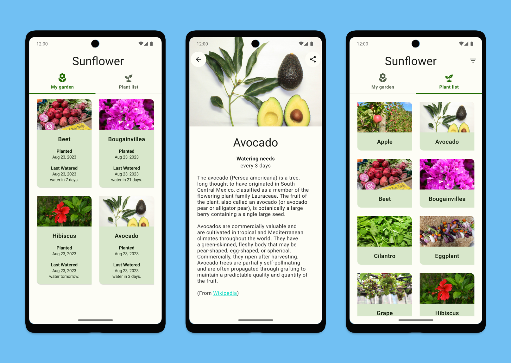

# Sunflower

A gardening app illustrating Android development best practices with XMLs to demonstrate the concept of RESTful Apis to students in GDSC(Google Developer Student Clubs) KIET as a workshop project.

## Screenshots

## Perenual API

Free API with over 10000 plant species for images & data. Get agriculture/farm/cultivation & botanic info on watering, sunlight, growth, pest diseases & more. Get the API link [`here`](https://perenual.com/docs/api).

## How to use?

Just fork this repo open up the folder containing the app in Android Studio and input your own Perenual API key to make it work.
